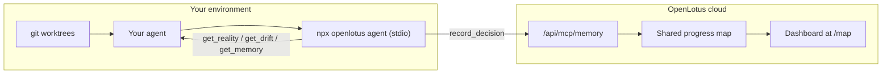

# vibe-to-ship — OpenLotus Engine Reference

Optional graph structure provider. The `vibe-to-ship` loop runs without it; OpenLotus simply turns graph sensing, drift detection, and decision logging into zero-effort tool calls and CLI commands.

---

## 1. How OpenLotus Powers Graph Engineering

| Graph Engineering Challenge | OpenLotus Solution |
|---|---|
| **Stale State / Context Drift** | `get_drift` & `npx openlotus sync` reconcile declared progress against observed git reality |
| **False Independence (File Overwrites)** | Built-in support for git worktree isolation across parallel workers |
| **Silent Node Failure** | `get_reality` senses total file counts, uncommitted diffs, and TODO/FIXME density |
| **Context Collapse in Verifiers** | MCP tools allow fresh-context verifiers to fetch exact snapshot facts without carrying chat history |
| **Decision Memory** | `record_decision` & `get_memory` append immutable decision nodes to the shared map + local log |

---

## 2. MCP Channel (`npx openlotus agent`)

When running inside an MCP-enabled agent session:

```bash
npx openlotus agent    # stdio MCP server, zero runtime deps, Node >= 18
```

(A local checkout can also launch `node cli/openlotus.mjs agent`, or point
directly at `cli/mcp.mjs` with an absolute path.)

### Available Tools & Graph Mapping

| Tool | Parameters | Beat | Graph Purpose |
|---|---|---|---|
| `get_reality` | None | Triage / Boot | Senses HEAD commit, branch, dirty diff, file count, TODO density, test presence |
| `get_drift` | `projectId` (optional) | Triage | Reconciles declared map against snapshot; returns `blocker`, `risk`, `info` findings + trajectory |
| `get_memory` | None | Boot / Learn | Reads the SHARED ProgressMap (goal, bet, focus, milestones, decisions, risks) + local pairing log |
| `create_project` | `name` (required), `description?`, `stage?` (idea/launched/growing/scaling), `url?`, `connectedTools?` | Setup / Triage | Creates a new project for the paired user. Same data as the web /new-project flow. Returns the project's id. |
| `switch_project` | `projectId` (required) | Setup | Points local `.openlotus/config.json` pairing at a project id (e.g. one just created). Cloud untouched — verify with `get_memory`. |
| `record_decision` | `title`, `context?`, `outcome?`, `evidence?` | Learn | Appends a decision node to the SHARED map (cloud, visible on dashboard) + local JSONL copy |
| `record_constraint` | `rule` (required), `rationale?`, `severity?` (watch/high), `scope?` | Setup | Records a boundary drift is measured against — never buried in decision prose |
| `read_constraints` | None | Act / Verify | Lists active constraints; call before proposing architecture, scope, or dependency changes |
| `report_failure` | `title`, `strategy` (required), `reason?`, `context?` | Act | Flags a failed attempt by stable strategy string so the same approach isn't silently retried |
| `record_lesson` | `pattern` (required), `diagnosis?`, `evidence?` | Learn | Distills the pattern/diagnosis so future sessions change approach |
| `report_action` | `summary` (required), `files?`, `result?` | Act | Fire-and-forget evidence log of consequential steps |
| `request_permission` | `action` (required), `reason?`, `risk?` (low/high) | Act | Records a human-approval request; the request itself is not approval |
| `bootstrap_state` | None | Setup | Seeds the ProgressMap from AGENTS.md / PROGRESS.md / README.md — same as `npx openlotus bootstrap` |

---

## 2b. External MCP Mode (recommended)

OpenLotus MCP runs **in your environment** — no hosted gateway. Your own agent connects directly:



1. Pair once: `npx openlotus pair` (no flags — opens your browser to `/pair`; log in, pick a project, the CLI finishes automatically)
2. Add to your MCP client config (copy `mcp.json.example`; for Claude Desktop use `claude_desktop_config.json`, for Cursor use `.cursor/mcp.json`) with the launch command `npx openlotus agent` (or the absolute path to `cli/mcp.mjs` for a local checkout).
3. Restart the client — thirteen tools appear under the `openlotus` server.

Then run this skill as usual. The tools read/write the same Postgres-backed ProgressMap the OpenLotus web dashboard renders, so every `record_decision` your agent makes shows up on the founder's dashboard in real time. Full contract: [`docs/mcp_architecture.md`](../../docs/mcp_architecture.md).

> Offline behavior: `get_memory` falls back to local data with a note; `record_decision` saves locally and warns that the dashboard won't see it until connectivity returns. Never assume a decision is shared without checking for `cloudError`.

---

## 3. CLI Channel (`npx openlotus`)

When MCP is not configured directly into the agent runtime, execute shell commands:

```bash
# 1. Pair local repo with OpenLotus workspace
npx openlotus pair   # no flags — browser flow at /pair

# 2. Seed the map once from the repo's own markdown (README/PROGRESS/AGENTS)
npx openlotus bootstrap

# 3. Sense repo, push snapshot, calculate & print drift
npx openlotus sync

# 4. View latest observed reality + drift findings
npx openlotus status

# 5. Run the MCP server (what your MCP config launches)
npx openlotus agent

# 6. Print the installed version
npx openlotus version
```

- **Config**: Credentials stored in `.openlotus/config.json` (gitignored).
- **Snapshot Payload**: Branch, commit hash, quiet days, dirty file list, TODO count, language breakdown, README/license/test presence.
- **Env overrides**: `OPENLOTUS_EMAIL`, `OPENLOTUS_PASSWORD`, `OPENLOTUS_BASE_URL` (CLI flags take precedence; pairing code flow needs no credentials).

---

## 4. Manual Fallback (No OpenLotus Installed)

When running in a bare repository without OpenLotus CLI or MCP:

1. **Reality Sensing**: Run `git status`, `git log --oneline -5`, `git diff --stat`.
2. **Debt Density**: Run `grep -rnE "TODO|FIXME|HACK" src/`.
3. **Anchor Verification**: Execute `npm test` or `npx tsc --noEmit`.
4. **Drift Calculation**: Manually diff output against `PROGRESS.md` or `STATE.md`.

The graph methodology remains identical — OpenLotus simply automates the data pipeline.